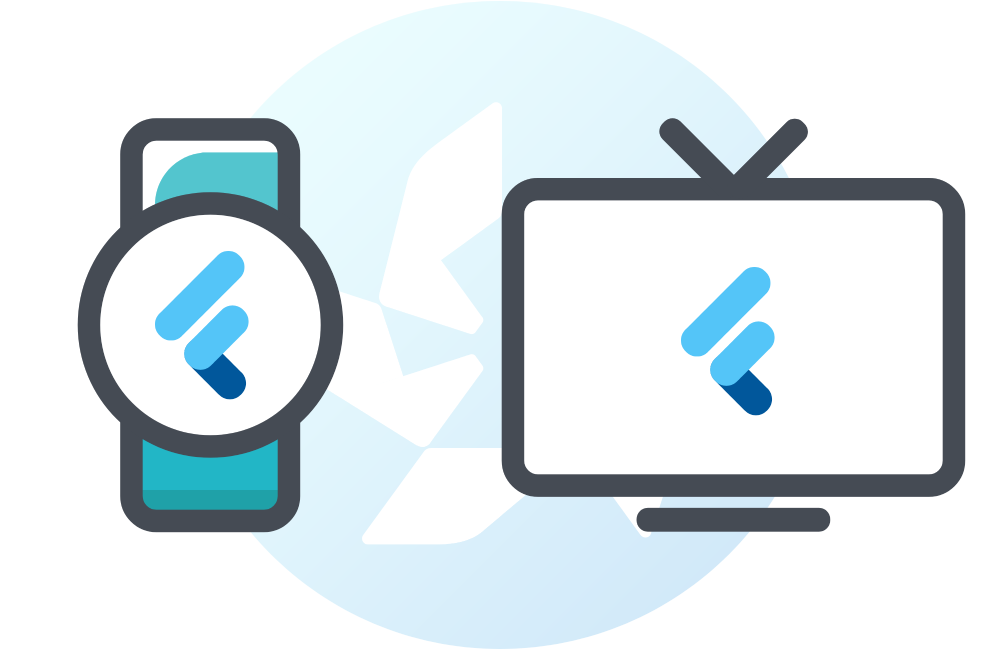

<p align="center"></p>

# Flutter for Tizen

[](https://github.com/flutter-tizen/flutter-tizen/actions)

An extension to the [Flutter SDK](https://github.com/flutter/flutter) for building Flutter applications for Tizen devices.

_**Note: This project is under development and available for testing purposes only.**_

_Flutter and the related logo are trademarks of Google LLC. We are not endorsed by or affiliated with Google LLC._

## Supported devices

- **Watch**: Tizen 4.0 (2018) or later
- **TV**: Tizen 6.0 (2021) or later (older models are not supported due to security reasons)
- **Emulator**: Tizen 4.0 or later

## Installation

- [Linux (64-bit)](doc/linux-install.md)
- [Windows (64-bit)](doc/windows-install.md)
- macOS (64-bit)

## Usage

`flutter-tizen` substitutes the original [`flutter`](https://flutter.dev/docs/reference/flutter-cli) CLI command. Only the command line interface is supported.

```sh
# Inspect the installed tooling and connected devices.
flutter-tizen doctor
flutter-tizen devices

# Set up a new project in the current directory, or add Tizen files if a Flutter project already exists.
flutter-tizen create .

# Build the project and run on a Tizen device. Use `-d [id]` to specify a device ID.
flutter-tizen run
flutter-tizen run --release
```

- See [Supported commands](doc/commands.md) for all available commands and their basic usage. See `[command] -h` for more information about each command.
- See [Getting started](doc/get-started.md) to create your first app and try **hot reload**.
- To **update** the flutter-tizen tool, run `git pull` in this directory.

## Docs

#### Tizen basics

- [Setting up Tizen SDK](doc/install-tizen-sdk.md)
- [Configuring Tizen devices for development](doc/configure-device.md)

#### App development

- [Getting started](doc/get-started.md)
- [Flutter Docs](https://flutter.dev/docs)
- [Debugging and inspecting Flutter apps with DevTools](doc/devtools-usage.md)

#### Plugins

- [A list of Flutter plugins available for Tizen](https://github.com/flutter-tizen/plugins)
- Writing a new plugin to use platform features (WIP)

#### Publishing

- [Publishing your app on Samsung Galaxy Store/TV App Store](doc/publish-app.md)

#### Advanced

- [Building the Flutter engine from source](https://github.com/flutter-tizen/engine/wiki/Building-the-engine)
- [Debugging the flutter-tizen tool](doc/debug-flutter-tizen.md)

## Issues

If you run into any problem, post an [issue](../../issues) in this repository to get help. If your issue is clearly not Tizen-specific (i.e. it's reproducible with the regular `flutter` command), you may file an issue in https://github.com/flutter/flutter/issues.

## Contribution

This project is community-driven and we welcome all your contribution and feedbacks. Consider filing an [issue](../../issues) or [pull request](../../pulls) to make this project better.
