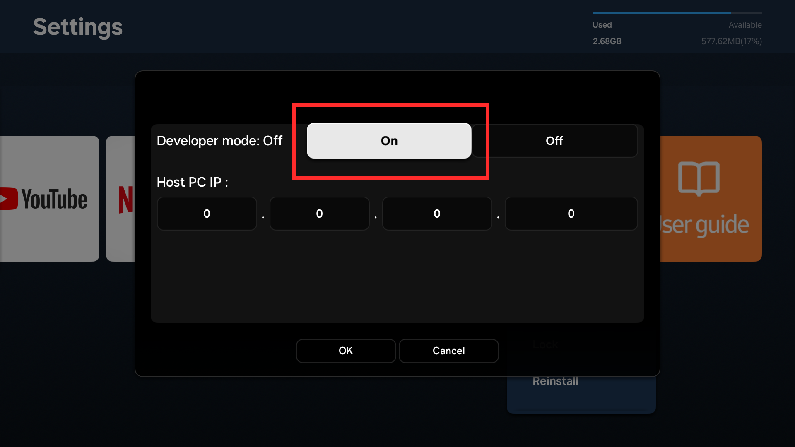
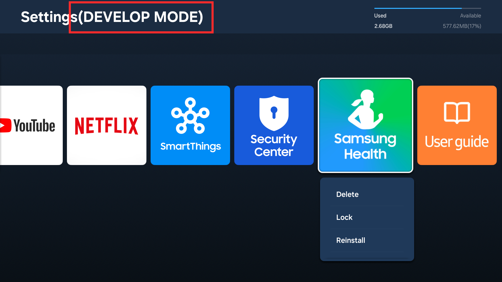

# Configuring Tizen devices for development

## TV

1. Make sure your host PC and TV are on the same network (connected to the same access point).

1. Enable the developer mode. (The images below are from a Tizen 9.0 TV. They may look different on other TVs.)

   1. Go to **Apps** and click the  **App Settings** icon.

      

      

   1. Enter the number **12345** using the remote control or on-screen number pad.

      

   1. Set **Developer mode** to **On**, enter the IP address of the host PC, and press **OK**.

      

   1. Restart the TV. You will see **Develop Mode** enabled after the TV restarts.

      

1. Find the path to `sdb` and add it to your PATH. For example, if you're using Linux or macOS and Tizen Studio has been installed to the default location, run:

   ```sh
   export PATH="$HOME/tizen-studio/tools:$PATH"
   ```

1. Connect to the device using its IP address.

   ```sh
   $ sdb connect 192.168.0.101
   connecting to 192.168.0.101:26101 ...
   connected to 192.168.0.101:26101

   $ sdb devices
   List of devices attached
   192.168.0.101:26101     device          SM-R800
   ```

## Raspberry Pi

### Install Tizen OS on Raspberry Pi 4

> [!NOTE]
> Raspberry Pi 3 is not supported since Tizen 8.0. Raspberry Pi 5 (64bit-only) can be used for experimental.

You need a Linux PC (for flashing), a Raspberry Pi 4 board, and a micro SD card with a minimum capacity of 16 GB.

1. Insert an SD card to your PC, and **format** the disk.

1. Find the device name (such as `/dev/sdc`). You can list all available devices using the `lsblk` command:

   ```sh
   $ lsblk
   NAME        MAJ:MIN RM   SIZE RO TYPE MOUNTPOINT
   sda           8:0    0 465.8G  0 disk
   └─sda1        8:1    0 465.8G  0 part
   sdb           8:16   1 119.5G  0 disk
   └─sdb1        8:17   1 119.5G  0 part /cdrom
   sdc           8:32   1  29.3G  0 disk
   └─sdc1        8:33   1  29.3G  0 part
   ```

1. Download a fusing script (`sd_fusing.py`).

   ```sh

   $ wget "https://review.tizen.org/git/?p=platform/kernel/tizen-fusing-scripts.git;a=blob_plain;f=scripts/sd_fusing.py;hb=HEAD" --output-document=sd_fusing.py
   $ chmod +x sd_fusing.py
   ```

1. Re-partition the SD card.

   ```sh
   $ sudo ./sd_fusing.py -d <SD card device name> -t <Target Board> --format
   ```
   For example:
   ```sh
   $ sudo ./sd_fusing.py -d /dev/sdc -t rpi4 --format
   ```

1. [Download a Tizen OS image](https://docs.tizen.org/platform/developing/flashing-rpi/#download-binaries). Visit the links below and download two `.tar.gz` files.
   - [tizen-boot-armv7l-rpi4](https://download.tizen.org/releases/milestone/TIZEN/Tizen-9.0/Tizen-9.0-Unified/latest/images/standard/tizen-boot-armv7l-rpi4//)
   - [tizen-headed-armv7l](https://download.tizen.org/releases/milestone/TIZEN/Tizen-9.0/Tizen-9.0-Unified/latest/images/standard/tizen-headed-armv7l/)

1. Flash the image to the SD card.

   ```sh
   $ sudo ./sd_fusing.py -d <SD card device namee> -b <Boot Image> <Platform Image> -t <Target Board>
   ```
   For example:
   ```sh
   $ sudo ./sd_fusing.py -d /dev/sdc -b tizen-9.0-unified_20241030.071206_tizen-boot-armv7l-rpi4.tar.gz tizen-9.0-unified_20241030.071206_tizen-headed-armv7l.tar.gz -t rpi4
   ```

1. Done. Remove the SD card and insert to your Pi device.

### Connect

1. Connect the Pi device to the same network as your host PC using an Ethernet cable.

   Alternatively, you can use some extra hardware (USB/PWR splitter) to connect Pi directly to the host PC in OTG (USB slave) mode. The Tizen device will be ready to use just after plugging the USB - the next step should be skipped.

1. Find the device IP address and connect to it. (`sdb` should be in your PATH.)

   ```sh
   $ sdb connect 192.168.0.101
   connecting to 192.168.0.101:26101 ...
   connected to 192.168.0.101:26101
   ```

1. Download the Raspberry Pi plugin (WLAN driver) from [Samsung Developers: Tizen Device Firmware](https://developer.samsung.com/tizen/TizenDeviceFirmware.html) and install it. Once the device is connected to Wi-Fi, you can connect to the device without an Ethernet cable.

## Troubleshooting

- #### Connection failure

  ```sh
  $ sdb connect 192.168.0.101
  connecting to 192.168.0.101:26101 ...
  failed to connect to 192.168.0.101:26101
  ```

  Make sure the target device and the host PC are on the same network. Make sure the host IP address is entered correctly in the developer mode settings (TV).

- #### Device offline

  ```sh
  $ sdb devices
  List of devices attached
  0000d85900006200        offline         device-1
  ```

  If the device is connected to a Windows host via USB, make sure to install the [Android USB Driver for Windows](https://developer.samsung.com/mobile/android-usb-driver.html).

- If you still have trouble connecting your device, open an [issue](https://github.com/flutter-tizen/flutter-tizen/issues) in this repo or ask for help at [Samsung Developers](https://forum.developer.samsung.com) / [Tizen Forums](https://developer.tizen.org/forums/sdk-ide/active) / [Stack Overflow](https://stackoverflow.com/questions/tagged/tizen).
