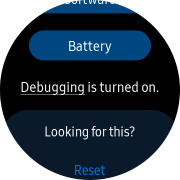
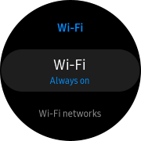
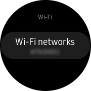
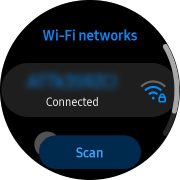
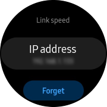

# Configuring Tizen devices for development

## Watch/TV

1. Make sure your host PC and target device are on the same network (connected to the same access point).

1. Enable the developer options.

   - **[Watch]:** Open **Settings - About watch - Software**, tap **Software version** multiple times, and make sure **Debugging** is turned on.

       

     Also make sure to disable **Bluetooth** and turn **Wi-Fi** to **Always on**.

     

     To discover your watch's IP address (in order to connect), you have to open **Settings - Connections - Wi-Fi - Wi-Fi Networks - (click the network you are connected to)**.

       

   - **[TV]:** Open **Apps**, enter **12345** using the remote control or the on-screen number keypad, switch **Developer mode** to **On**, enter your host's IP address, and press **OK**. You will see **Develop mode** is enabled in **Apps** after rebooting the TV.

     

     

     

1. Find the path to `sdb` and add to your PATH. For example, if you're using Linux or macOS and Tizen Studio has been installed to the default location, run:

   ```sh
   export PATH="$HOME/tizen-studio/tools:$PATH"
   ```

1. Connect to the device using the device's IP address.

   ```sh
   $ sdb connect 192.168.0.101
   connecting to 192.168.0.101:26101 ...
   connected to 192.168.0.101:26101

   $ sdb devices
   List of devices attached
   192.168.0.101:26101     device          SM-R800
   ```

## Raspberry Pi

### Install Tizen OS on Raspberry Pi 3/4

You need a Linux host PC (for flashing), a Raspberry Pi 3 or 4 board, and a micro SD card with a minimum capacity of 8 GB.

1. Insert the SD card into your PC, and **format** the drive.

1. Find the device name (such as `/dev/sdc`). You can list all available devices using the `lsblk` command:

   ```sh
   $ lsblk
   NAME        MAJ:MIN RM   SIZE RO TYPE MOUNTPOINT
   sda           8:0    0 465.8G  0 disk
   └─sda1        8:1    0 465.8G  0 part
   sdb           8:16   1 119.5G  0 disk
   └─sdb1        8:17   1 119.5G  0 part /cdrom
   sdc           8:32   1  29.3G  0 disk
   └─sdc1        8:33   1  29.3G  0 part
   ```

1. Download the flashing script from the official repository:

   - https://git.tizen.org/cgit/platform/kernel/u-boot/plain/scripts/tizen/sd_fusing_rpi3.sh?h=tizen
   - https://review.tizen.org/git/?p=platform/kernel/u-boot.git;a=blob_plain;f=scripts/tizen/sd_fusing_rpi3.sh;hb=refs/heads/tizen

1. Re-partition the SD card drive (replace `/dev/sdc` with your device name):

   ```sh
   $ chmod 755 sd_fusing_rpi3.sh
   $ sudo ./sd_fusing_rpi3.sh -d /dev/sdc --format
   
   Raspberry Pi downloader, version 2.1.0

   Device: /dev/sdc

   /dev/sdc will be formatted, Is it OK? [y/<n>]

   ...

   End /dev/sdc format
   ```

1. Download the Tizen OS image. Visit the links below and download two `.tar.gz` files (for boot and platform). Choose Tizen 6.0 (arm) if you are not sure which image to download.

   | Tizen version | Image type | Latest image |
   |-|-|-|
   | Tizen 5.5 | Pi 3 (arm) | [iot-boot-armv7l-rpi3](http://download.tizen.org/snapshots/tizen/5.5-unified/latest/images/standard/iot-boot-armv7l-rpi3)<br>[iot-headed-3parts-armv7l-rpi3](http://download.tizen.org/snapshots/tizen/5.5-unified/latest/images/standard/iot-headed-3parts-armv7l-rpi3) |
   | Tizen 6.0 | Pi 3 (arm) | [iot-boot-armv7l-rpi3](http://download.tizen.org/snapshots/tizen/6.0-unified/latest/images/standard/iot-boot-armv7l-rpi3)<br>[iot-headed-3parts-armv7l-rpi](http://download.tizen.org/snapshots/tizen/6.0-unified/latest/images/standard/iot-headed-3parts-armv7l-rpi) |
   | | Pi 3 (arm64) | [iot-boot-arm64-rpi3](http://download.tizen.org/snapshots/tizen/6.0-unified/latest/images/standard/iot-boot-arm64-rpi3)<br>[iot-headed-3parts-aarch64-rpi](http://download.tizen.org/snapshots/tizen/6.0-unified/latest/images/standard/iot-headed-3parts-aarch64-rpi) |
   | | Pi 4 (arm) | [iot-boot-armv7l-rpi4](http://download.tizen.org/snapshots/tizen/6.0-unified/latest/images/standard/iot-boot-armv7l-rpi4)<br>[iot-headed-3parts-armv7l-rpi](http://download.tizen.org/snapshots/tizen/6.0-unified/latest/images/standard/iot-headed-3parts-armv7l-rpi) |
   | | Pi 4 (arm64) | [iot-boot-arm64-rpi4](http://download.tizen.org/snapshots/tizen/6.0-unified/latest/images/standard/iot-boot-arm64-rpi4)<br>[iot-headed-3parts-aarch64-rpi](http://download.tizen.org/snapshots/tizen/6.0-unified/latest/images/standard/iot-headed-3parts-aarch64-rpi) |

1. Flash the image to the SD card. For example:

   ```sh
   $ sudo ./sd_fusing_rpi3.sh -d /dev/sdc -b tizen-6.0-unified_20210512.1_iot-boot-arm64-rpi3.tar.gz \
   tizen-6.0-unified_20210512.1_iot-headed-3parts-aarch64-rpi.tar.gz

   Raspberry Pi downloader, version 2.1.0

   Device: /dev/sdc
   Fusing binary:

   ...

   [Fusing user.img (108 MiB)]
   109051904 bytes (109 MB, 104 MiB) copied, 7 s, 15.1 MB/s
   27+1 records in
   27+1 records out
   113410048 bytes (113 MB, 108 MiB) copied, 7.52632 s, 15.1 MB/s
   resize2fs 1.45.5 (07-Jan-2020)
   Resizing the filesystem on /dev/sdc5 to 6456832 (4k) blocks.
   The filesystem on /dev/sdc5 is now 6456832 (4k) blocks long.
   ```

1. Done. Detach the SD card and insert to the Pi device.

### Connect

1. Connect the Pi device to the same network as your host PC using an Ethernet or Wi-Fi (built-in or extra USB dongle) connection.

   > Alternatively, you can use some extra hardware (USB/PWR splitter) to connect Pi directly to the host PC in OTG (USB slave) mode. The Tizen device will be ready to use just after plugging the USB - the next step should be skipped.

1. Find the device's IP address and connect. If `sdb` is not on your PATH, refer to the above guide for Watch/TV.

   ```sh
   $ sdb connect 192.168.0.101
   connecting to 192.168.0.101:26101 ...
   connected to 192.168.0.101:26101
   ```

## Troubleshooting

- #### Connection failure

  ```sh
  $ sdb connect 192.168.0.101
  connecting to 192.168.0.101:26101 ...
  failed to connect to 192.168.0.101:26101
  ```

  Check if the target device is on the same network as the host, and the port is not blocked by a firewall. For _Smart TV_, make sure you entered the host IP address correctly in the developer mode settings.

- #### Device unauthorized

  ```sh
  $ sdb devices
  List of devices attached
  192.168.0.101:26101     unauthorized    <unknown>
  ```

  Check the confirmation dialog on the device and approve the connection.

- #### Device offline

  ```sh
  $ sdb devices
  List of devices attached
  0000d85900006200        offline         device-1
  ```
  
  If the device is connected to a Windows host via USB, make sure to install the [Android USB Driver for Windows](https://developer.samsung.com/mobile/android-usb-driver.html).

- #### Device not listed when using WSL

  ```powershell
  PS> sdb devices
  List of devices attached
  PS> sdb kill-server
  PS> sdb devices
  * Server is not running. Start it now on port 26099 *
  * Server has started successfully *
  List of devices attached
  00000314f59bd733        device          SM-R800
  ```

  If you are using WSL and Tizen Studio has been installed onto both Windows and Linux, you have to start the sdb server from the Windows side.

- If you still have any problem, open an [issue](../../../issues) in this repo or ask for help in [Samsung Developers](https://forum.developer.samsung.com/) / [Tizen Forums](https://developer.tizen.org/forums/sdk-ide/active) / [stackoverflow](https://stackoverflow.com/questions/tagged/tizen).
