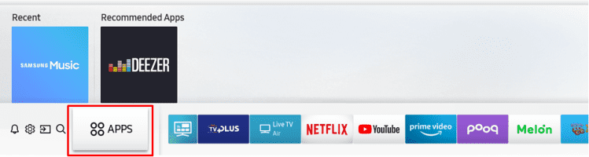

# Configuring Tizen devices for development

## TV

1. Make sure your host PC and TV are on the same network (connected to the same access point).

1. Enable the developer mode.(OS version: Tizen 9.0)

   1. Move **Apss** page and open **Apps Settings** application.

      

      

   1. Enter the number **12345** using the remote control or on-screen number pad.

      

   1. Set **Developer mode** to **On**, enter the IP address of the host PC, and press **OK**.

      

   1. Restart the TV. You will see **Develop Mode** enabled in **Apps** after the TV restarts.

      

1. Find the path to `sdb` and add it to your PATH. For example, if you're using Linux or macOS and Tizen Studio has been installed to the default location, run:

   ```sh
   export PATH="$HOME/tizen-studio/tools:$PATH"
   ```

1. Connect to the device using its IP address.

   ```sh
   $ sdb connect 192.168.0.101
   connecting to 192.168.0.101:26101 ...
   connected to 192.168.0.101:26101

   $ sdb devices
   List of devices attached
   192.168.0.101:26101     device          SM-R800
   ```

## Raspberry Pi

### Install Tizen OS on Raspberry Pi 4

You need a Linux PC (for flashing), a Raspberry Pi 4 board, and a micro SD card with a minimum capacity of 8 GB.

1. Insert an SD card to your PC, and **format** the disk.

1. Find the device name (such as `/dev/sdc`). You can list all available devices using the `lsblk` command:

   ```sh
   $ lsblk
   NAME        MAJ:MIN RM   SIZE RO TYPE MOUNTPOINT
   sda           8:0    0 465.8G  0 disk
   └─sda1        8:1    0 465.8G  0 part
   sdb           8:16   1 119.5G  0 disk
   └─sdb1        8:17   1 119.5G  0 part /cdrom
   sdc           8:32   1  29.3G  0 disk
   └─sdc1        8:33   1  29.3G  0 part
   ```

1. Download a flashing script (`sd_fusing_rpi3.sh`) from one of the following URLs.

   - https://git.tizen.org/cgit/platform/kernel/u-boot/plain/scripts/tizen/sd_fusing_rpi3.sh?h=tizen
   - https://review.tizen.org/git/?p=platform/kernel/u-boot.git;a=blob_plain;f=scripts/tizen/sd_fusing_rpi3.sh;hb=refs/heads/tizen

   Note: You may notice that the repository also contains a script for Pi 4 (`sd_fusing_rpi4.sh`). Do not use it.

1. Re-partition the SD card (replace `/dev/sdc` with your own device name):

   ```sh
   $ chmod 755 sd_fusing_rpi3.sh
   $ sudo ./sd_fusing_rpi3.sh -d /dev/sdc --format

   Raspberry Pi downloader, version 2.1.0

   Device: /dev/sdc

   /dev/sdc will be formatted, Is it OK? [y/<n>]

   ...

   End /dev/sdc format
   ```

1. Download a Tizen OS image. Visit the links below and download two `.tar.gz` files.

   - [tizen-boot-arm64-rpi4](http://download.tizen.org/releases/milestone/TIZEN/Tizen/Tizen-Unified/latest/images/standard/tizen-boot-arm64-rpi4)
   - [tizen-headed-aarch64](http://download.tizen.org/releases/milestone/TIZEN/Tizen/Tizen-Unified/latest/images/standard/tizen-headed-aarch64)

1. Flash the image to the SD card. For example:

   ```sh
   $ sudo ./sd_fusing_rpi3.sh -d /dev/sdc -b tizen-7.0-unified_20221101.000810_tizen-boot-arm64-rpi4.tar.gz \
       tizen-7.0-unified_20221101.000810_tizen-headed-aarch64.tar.gz

   Raspberry Pi downloader, version 2.1.0

   Device: /dev/sdc
   Fusing binary:

   ...

   [Fusing user.img (500 MiB)]
   520093696 bytes (520 MB, 496 MiB) copied, 65 s, 8.0 MB/s
   125+0 records in
   125+0 records out
   524288000 bytes (524 MB, 500 MiB) copied, 65.7336 s, 8.0 MB/s
   ```

1. Done. Remove the SD card and insert to your Pi device.

### Connect

1. Connect the Pi device to the same network as your host PC using an Ethernet cable.

   Alternatively, you can use some extra hardware (USB/PWR splitter) to connect Pi directly to the host PC in OTG (USB slave) mode. The Tizen device will be ready to use just after plugging the USB - the next step should be skipped.

1. Find the device IP address and connect to it. (`sdb` should be in your PATH.)

   ```sh
   $ sdb connect 192.168.0.101
   connecting to 192.168.0.101:26101 ...
   connected to 192.168.0.101:26101
   ```

1. Download the Raspberry Pi plugin (WLAN driver) from [Samsung Developers: Tizen Device Firmware](https://developer.samsung.com/tizen/TizenDeviceFirmware.html) and install it. Once the device is connected to Wi-Fi, you can connect to the device without an Ethernet cable.

## Troubleshooting

- #### Connection failure

  ```sh
  $ sdb connect 192.168.0.101
  connecting to 192.168.0.101:26101 ...
  failed to connect to 192.168.0.101:26101
  ```

  Make sure the target device and the host PC are on the same network. Make sure the host IP address is entered correctly in the developer mode settings (TV).

- #### Device offline

  ```sh
  $ sdb devices
  List of devices attached
  0000d85900006200        offline         device-1
  ```

  If the device is connected to a Windows host via USB, make sure to install the [Android USB Driver for Windows](https://developer.samsung.com/mobile/android-usb-driver.html).

- If you still have trouble connecting your device, open an [issue](https://github.com/flutter-tizen/flutter-tizen/issues) in this repo or ask for help at [Samsung Developers](https://forum.developer.samsung.com) / [Tizen Forums](https://developer.tizen.org/forums/sdk-ide/active) / [Stack Overflow](https://stackoverflow.com/questions/tagged/tizen).
