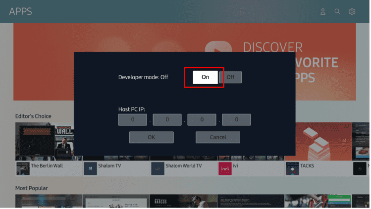

# Configuring Tizen devices for development

To debug Flutter apps on your Tizen device (watch or TV), you need to configure a TCP/IP connection between the device and your host PC using Wi-Fi.

1. Make sure the host and the target device are on the same network (connected to the same access point).

1. Enable the developer options.

   - For _Galaxy Watch_, open **Settings - About watch - Software** and tap **Software version** multiple times.

      

   - For _Smart TV_, open **Apps**, enter **12345** using the remote control or the on-screen number keypad, switch **Developer mode** to **On**, enter your host's IP address, and press **OK**. You will see **Develop mode** is enabled in **Apps** after rebooting the TV.

     

     

     

1. (Optional) Find the path to `sdb` (`<tizen-studio>/tools`) and add to your PATH. If you're using Linux or macOS and Tizen Studio has been installed to the default location, run:

   ```sh
   export PATH=$HOME/tizen-studio/tools:$PATH
   ```

1. Establish a connection using the device's IP address.

   ```sh
   $ sdb connect 192.168.0.101
   connecting to 192.168.0.101:26101 ...
   connected to 192.168.0.101:26101

   $ sdb devices
   List of devices attached
   192.168.0.101:26101     device          SM-R800
   ```

## Troubleshooting

- #### Connection failure

  ```sh
  $ sdb connect 192.168.0.101
  connecting to 192.168.0.101:26101 ...
  failed to connect to 192.168.0.101:26101
  ```

  Check if the target device is on the same network as the host, and the port is not blocked by a firewall. For _Smart TV_, make sure you entered the host IP address correctly in the developer mode settings.

- #### Device unauthorized

  ```sh
  $ sdb devices
  List of devices attached
  192.168.0.101:26101     unauthorized    <unknown>
  ```

  Check the confirmation dialog on the device and approve the connection.

- If you still have any problem, open an [issue](../../../issues) in this repo or ask for help in [Samsung Developers](https://forum.developer.samsung.com/) / [Tizen Forums](https://developer.tizen.org/forums/sdk-ide/active) / [stackoverflow](https://stackoverflow.com/questions/tagged/tizen).
