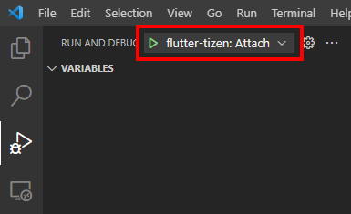
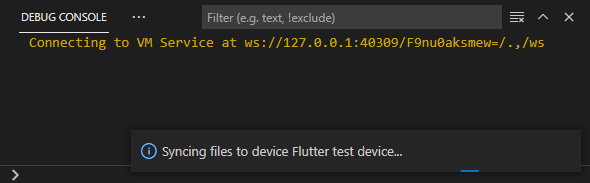
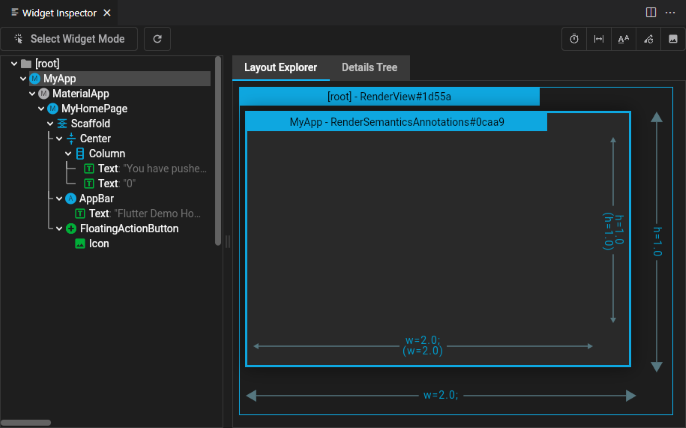
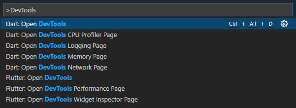
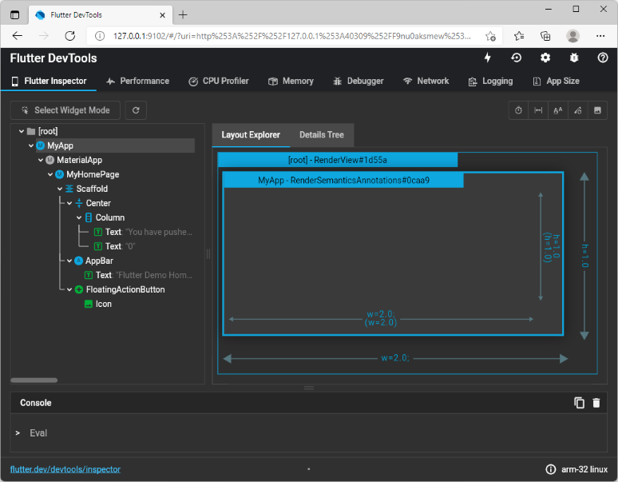

# Debugging apps

## Debugging in VS Code

You can use VS Code's built-in debugging features to debug Flutter apps running on Tizen devices.

Note: The debugger can only **attach** to an already running app. **Launching** an app from VS Code is not currently supported.

1. Open your app project folder in VS Code.

1. Start the app in either **debug** or **profile** mode from **command line** (press `Ctrl`+<code>`</code> to open the integrated Terminal).

   ```sh
   # Start in debug mode (for debugging app code or inspecting UI).
   $ flutter-tizen run

   # Start in profile mode (for performance profiling).
   $ flutter-tizen run --profile
   ```

   Optional: The `--start-paused` option can be given to delay app execution until a debug session starts.

1. Once the app launches, click the **Run and Debug** icon in the left menu bar, and make sure **flutter-tizen: Attach (project)** is selected as an active debug configuration.

   

   Note: If you can't find **flutter-tizen: Attach (project)** in the configuration list, it is likely that the app hasn't launched successfully, or the folder you opened in VS Code is not an app project folder.

1. Click the Run (▷) button or press `F5` to start debugging. It may take a few seconds for a debugger to connect to the running app.

   

1. Once the debugger is connected, the **Debug toolbar** will appear on the top of the editor. You can now debug your code by setting **breakpoints** and examining variables in the editor (debug mode only). Also, **Hot reload** will be triggered whenever you make code changes.

   

1. The [Flutter Inspector](https://flutter.dev/docs/development/tools/devtools/inspector) page can be opened by clicking the right most icon (🔍) in the Debug toolbar.

   

   Also, additional DevTools commands become available in the Command Palette (`Ctrl`+`Shift`+`P`) while the debug session is active. DevTools is a suite of performance and debugging tools for Dart and Flutter. For detailed information on DevTools, visit [Flutter Docs: DevTools](https://flutter.dev/docs/development/tools/devtools/overview).

   

## Opening DevTools in browser

1. Start an app in either debug or profile mode using the `flutter-tizen run` command.

1. Once the app launches, you will see a message in your terminal that looks like:

   ```sh
   Flutter DevTools, a Flutter debugger and profiler, on Tizen SM-R800 is available at:
   http://127.0.0.1:9100?uri=http%3A%2F%2F127.0.0.1%3A...
   ```

   Open your browser and navigate to the URL.

   

## Other resources

The following resources provide more information on debugging and optimizing Flutter apps.

- [Flutter Docs: Debugging Flutter apps](https://docs.flutter.dev/testing/debugging)
- [Flutter Docs: Flutter performance profiling](https://docs.flutter.dev/perf/ui-performance)
- [Flutter Docs: Performance best practices](https://docs.flutter.dev/perf/best-practices)
