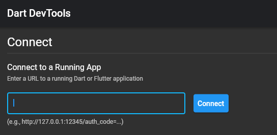

# Debugging and inspecting Flutter apps with DevTools

[DevTools](https://flutter.dev/docs/development/tools/devtools/overview) is a suite of performance and debugging tools for Dart and Flutter.

DevTools is already integrated with the flutter-tizen tool. To open it, first start your app in either debug or profile mode. Once the app launches, enter "v" in your terminal, then DevTools should appear in your browser.

```sh
# Start an app in debug mode
$ flutter-tizen run

# Start an app in profile mode
$ flutter-tizen run --profile
```


Alternatively, you can use the `pub global` command to install and start a standalone DevTools server:

```sh
# Install DevTools
flutter-tizen pub global activate devtools

# Start DevTools
flutter-tizen pub global run devtools
```

Once the DevTools server starts, open your browser and navigate to `http://localhost:9100`. Then, you should see this connect dialog:



You need an observatory URI of a running app that you want to connect to. Start your app in either debug or profile mode using the `flutter-tizen run` command, and then you will see a message in your terminal that looks like:

```
An Observatory debugger and profiler on Tizen SM-R800 is available at: http://127.0.0.1:34025/wG7X7TSM38k=/
```

Paste this URL (`http://...`) into the connect dialog above.

## Debugger

The Debugger tab should appear in DevTools if you launched an app in debug mode (`flutter-tizen run`). Although the flutter-tizen tool is not natively integrated with existing IDEs like Android Studio and VS Code, this tab provides you with source-level debugging experience with support for breakpoints, stepping, and variable inspection.


**Tip**: To set breakpoints before any code execution, run with the `--start-paused` option:

```sh
flutter-tizen run --start-paused
```

For detailed usage of the debugger, see [Flutter Docs: Using the debugger](https://flutter.dev/docs/development/tools/devtools/debugger).

## Performance view

To diagnose performance issues (frame drops) in a Flutter app, you need to run the app in profile mode:

```sh
flutter-tizen run --profile
```

Once the app launches, navigate to the Performance tab in DevTools.


For more information on this view, see [Flutter Docs: Using the Performance view](https://flutter.dev/docs/development/tools/devtools/performance).

## Other resources

There are also other things that you can do with DevTools:

- [Flutter Inspector](https://flutter.dev/docs/development/tools/devtools/inspector): Inspecting the UI layout and state of a Flutter app
- [CPU Profiler](https://flutter.dev/docs/development/tools/devtools/cpu-profiler): CPU profiling for a Flutter app
- [Memory](https://flutter.dev/docs/development/tools/devtools/memory): Debugging memory issues in a Flutter app
- [Network](https://flutter.dev/docs/development/tools/devtools/network): Network profiling for a Flutter app
- [App Size](https://flutter.dev/docs/development/tools/devtools/app-size): Analyzing code and app size

You might also find these Flutter docs useful:

- [Debugging Flutter apps](https://flutter.dev/docs/testing/debugging)
- [Flutter performance profiling](https://flutter.dev/docs/perf/rendering/ui-performance)
- [Performance best practices](https://flutter.dev/docs/perf/rendering/best-practices)
