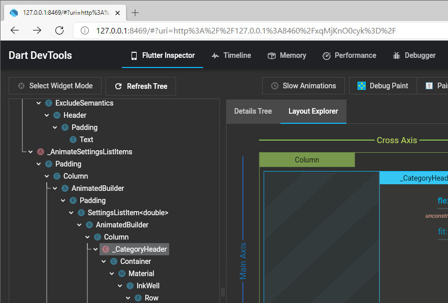
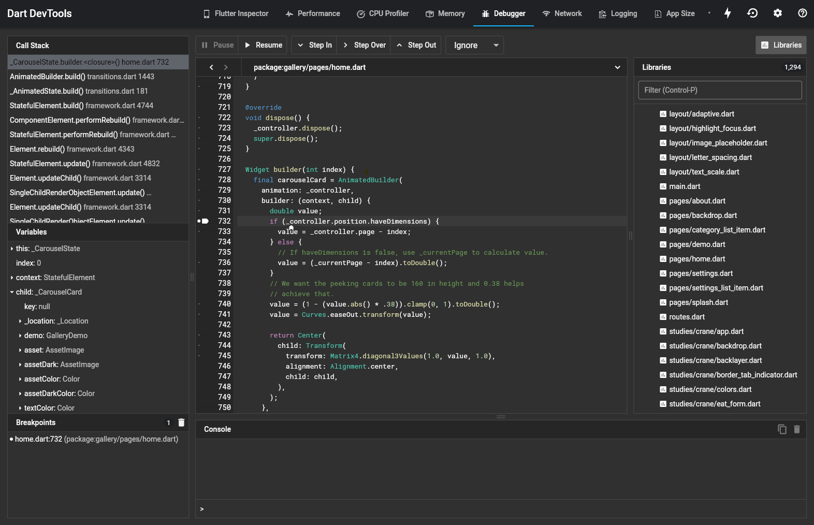
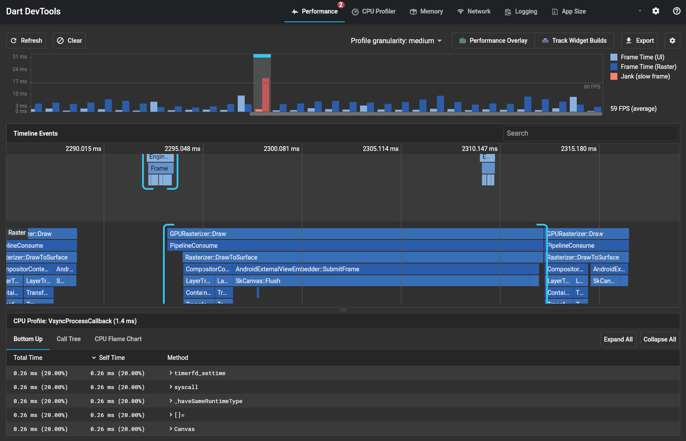

# Debugging and inspecting Flutter apps with DevTools

[DevTools](https://flutter.dev/docs/development/tools/devtools/overview) is a suite of performance and debugging tools for Dart and Flutter.

DevTools is already integrated with the flutter-tizen tool. To open it, first start your app in either debug or profile mode:

```sh
# Start in debug mode
$ flutter-tizen run

# Start in profile mode
$ flutter-tizen run --profile
```

Once the app launches, you will see a message in your terminal that looks like:

```sh
Flutter DevTools, a Flutter debugger and profiler, on Tizen SM-R800 is available at:
http://127.0.0.1:9100?uri=http%3A%2F%2F127.0.0.1%3A...
```

Open your browser and navigate to the URL, then you will see a page that looks like:



## Debugger

You will see the _Debugger_ tab enabled in DevTools after starting your app in debug mode (`flutter-tizen run`). Although the flutter-tizen tool is not natively integrated with existing IDEs like Android Studio and VS Code, this tab provides you with source-level debugging experience with support for breakpoints, stepping, and variable inspection.



**Tip**: To set breakpoints before any code execution, use [programmatic breakpoints](https://flutter.dev/docs/testing/code-debugging#setting-breakpoints) or run with the `--start-paused` option:

```sh
flutter-tizen run --start-paused
```

For detailed usage of the debugger, see [Flutter Docs: Using the debugger](https://flutter.dev/docs/development/tools/devtools/debugger).

## Performance view

To diagnose performance issues (frame drops) in a Flutter app, you need to run the app in profile mode:

```sh
flutter-tizen run --profile
```

Once the app launches, navigate to the _Performance_ tab in DevTools.



For more information on this view, see [Flutter Docs: Using the Performance view](https://flutter.dev/docs/development/tools/devtools/performance).

## Other resources

There are also other things that you can do with DevTools:

- [Flutter Inspector](https://flutter.dev/docs/development/tools/devtools/inspector): Inspecting the UI layout and state of a Flutter app
- [CPU Profiler](https://flutter.dev/docs/development/tools/devtools/cpu-profiler): CPU profiling for a Flutter app
- [Memory](https://flutter.dev/docs/development/tools/devtools/memory): Debugging memory issues in a Flutter app
- [Network](https://flutter.dev/docs/development/tools/devtools/network): Network profiling for a Flutter app
- [App Size](https://flutter.dev/docs/development/tools/devtools/app-size): Analyzing code and app size

You might also find these Flutter docs useful:

- [Debugging Flutter apps](https://flutter.dev/docs/testing/debugging)
- [Flutter performance profiling](https://flutter.dev/docs/perf/rendering/ui-performance)
- [Performance best practices](https://flutter.dev/docs/perf/rendering/best-practices)
