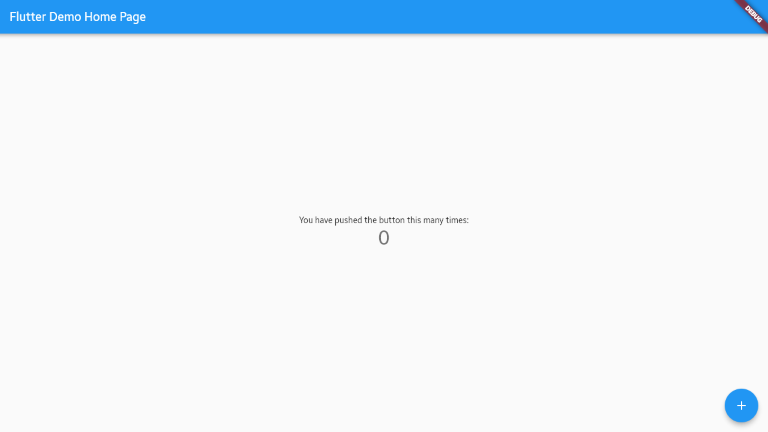

# Getting started

## Set up the environment

1. Make sure your Tizen device meets the minimum version [requirement](../README.md#supported-devices).

   Note: To see which version of Tizen your device is running, [connect the device](configure-device.md) to your PC, run `sdb capability`, and find the `platform_version` value.

   ```
   $ sdb capability
   ...
   device_name:Tizen
   platform_version:6.0
   ...
   ```

1. Install [**flutter-tizen**](../README.md#installation) and any required tooling. After installation, run `flutter-tizen doctor` to check if there's any issue. (You can ignore any Android-related warnings. Only `Flutter` and `Tizen toolchain` are required.)

   ```
   $ flutter-tizen doctor
   Doctor summary (to see all details, run flutter doctor -v):
   [✓] Flutter (Channel unknown, 2.2.1, on Linux, locale C.UTF-8)
   [✓] Tizen toolchain - develop for Tizen devices
   ...
   [✓] Connected device (2 available)
   ```

1. Install [**Visual Studio Code**](https://code.visualstudio.com/Download). You can also use your favorite editor.

1. Open Visual Studio Code and click the **Extensions** icon in the left menu bar. Search **Dart** in the search field and install.

   

   Note: flutter-tizen only supports the command line interface. The [**Flutter**](https://marketplace.visualstudio.com/items?itemName=Dart-Code.flutter) extension is not fully compatible with Tizen devices.

1. Launch an emulator or connect your Tizen device.

   - To launch an emulator instance, use either _Emulator Manager_ or the [`flutter-tizen emulators`](commands.md#emulators) command.
   - To connect a Tizen device to your PC, read the instructions in [Configuring Tizen devices for development](configure-device.md).

   You can use the `devices` command to list all connected devices.

   ```
   $ flutter-tizen devices
   2 connected devices:

   Tizen SM-R800 (mobile)           • 0000d84f00006200     • flutter-tester • Tizen 5.5
   Tizen T-samsung-8.0-x86 (mobile) • emulator-26101       • flutter-tester • Tizen 8.0 (emulator)
   ```

## Test drive

Reference: [Flutter Docs: Test drive](https://flutter.dev/docs/get-started/test-drive?tab=terminal)

### Create the app

Use the `create` command to create a new project:

```
$ flutter-tizen create myapp
$ cd myapp
```

The command creates a Flutter project directory called `myapp` that contains a simple demo app that uses [Material Components](https://material.io/guidelines). You can open the directory in Visual Studio Code to edit app source code (`lib/main.dart`).

### Run the app

Run the app with the following command:

```
$ flutter-tizen run
```

After the app build completes, you'll see the starter app on your device.



Note: If the app installation fails with an error, make sure you have created a valid certificate profile in _Certificate Manager_. For more information, refer to [TPK installation troubleshooting](https://github.com/flutter-tizen/flutter-tizen/wiki/TPK-installation-troubleshooting).

## Try hot reload

Flutter's ability to reload the code of a live running app without restarting or losing app state is called [Stateful Hot Reload](https://flutter.dev/docs/development/tools/hot-reload). After launching an app using the `run` command, you will see this help message:

```
Syncing files to device Tizen SM-R800...                           516ms

Flutter run key commands.
r Hot reload. 🔥🔥🔥
R Hot restart.
h List all available interactive commands.
d Detach (terminate "flutter run" but leave application running).
c Clear the screen
q Quit (terminate the application on the device).

A Dart VM Service on Tizen SM-R800 is available at: http://127.0.0.1:34025/wG7X7TSM38k=/
```

Simply make any change to the app source (`lib/main.dart`), type `r`, and check if the change is made to the running app.

```
Performing hot reload...
Reloaded 1 of 448 libraries in 978ms.
```
