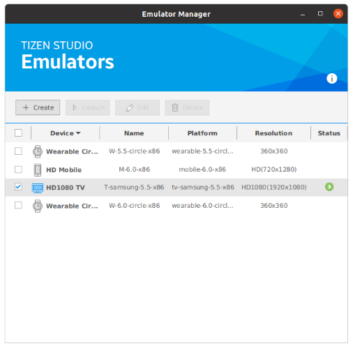

# Setting up Tizen Studio

Download and install the latest release of Tizen Studio from the below link. It is recommended to use the GUI installer although you can still build Flutter apps with CLI only.

- [Download Tizen Studio](https://developer.tizen.org/development/tizen-studio/download)
- [Tizen Docs: Installing Tizen Studio](https://docs.tizen.org/application/tizen-studio/setup/install-sdk)

## Install required packages

After installing Tizen Studio, the _Package Manager_ window will automatically pop up (otherwise launch it manually). Install the following packages required by flutter-tizen.

- [Tizen SDK tools] - [Native CLI]
- [Tizen SDK tools] - [Baseline SDK] - [Certificate Manager]
- [Extension SDK] - [IOT-Headed-6.0] - [Native app. development (IDE)]
- [Extension SDK] - [Samsung Certificate Extension]

To enable emulator support, install the following additional packages.

- [8.0 Tizen] - [Emulator]
- [6.0 Mobile] - [Native app. development (IDE)]
- [Extension SDK] - [TV Extensions-x.x] - [Emulator]

Note: The packages can also be installed using the command line interface by following the instructions of `flutter-tizen doctor -v` after installing flutter-tizen.

If you cannot see extension packages in the _Extension SDK_ tab, click the configuration button (⚙️) and make sure you are using the latest official distribution.

## Set up Tizen emulators

If you installed emulator packages in the previous step, you can use _Emulator Manager_ to manage and launch emulator instances. If you can't see any emulator instance in the device list, open _Package Manager_ and install emulator packages of your target platform.

To launch an emulator, select a device and press _Launch_. You can also use the [`flutter-tizen emulators`](commands.md#emulators) command to launch an emulator without _Emulator Manager_.

Note: Launching a Tizen emulator requires HW virtualization (Intel VT-x/AMD-V) support. For more information, see [Tizen Docs: Increasing the Application Execution Speed](https://docs.tizen.org/application/tizen-studio/common-tools/emulator/#increasing-the-application-execution-speed).

## Create a certificate profile

To install your app on a Tizen device or publish it to the TV App Store, you need to sign the app with a valid certificate. Use _Certificate Manager_ (GUI), or the [`tizen certificate/security-profiles`](https://docs.tizen.org/application/tizen-studio/common-tools/command-line-interface) command (CLI) to create a certificate profile.

Choose _Samsung_ instead of _Tizen_ as the profile type if you're not sure.

You should specify the DUID of your device (including emulator) when creating a distributor certificate. The DUID will automatically appear in the list if the device is connected to the PC.

For detailed instructions, see [Samsung Developers: Creating Certificates](https://developer.samsung.com/smarttv/develop/getting-started/setting-up-sdk/creating-certificates.html).
