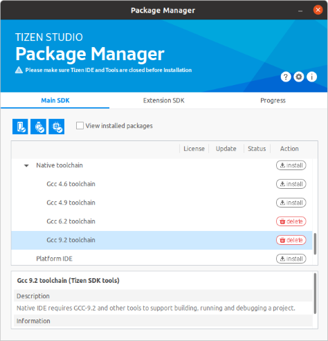
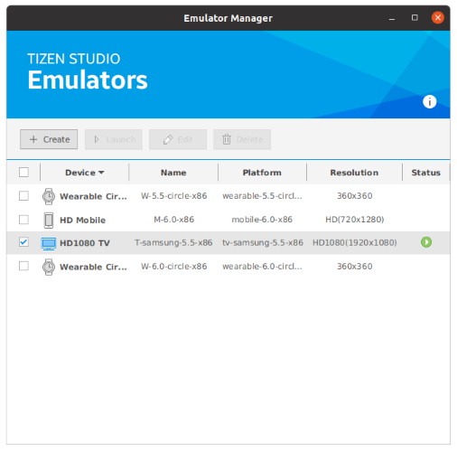
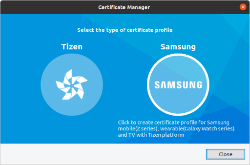
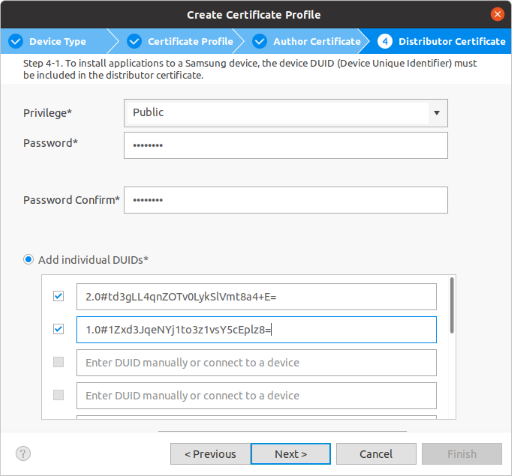

# Setting up Tizen SDK

Download and install the latest release of Tizen Studio from the below link. It is recommended to use the GUI installer although you can still build Flutter apps with CLI only.

- [Download Tizen Studio](https://developer.tizen.org/development/tizen-studio/download)
- [Tizen Docs: Installing Tizen Studio](https://docs.tizen.org/application/tizen-studio/setup/install-sdk)

If done, make sure the tools path (usually `~/tizen-studio/tools`) is in your PATH. If it's not, add it by running `export PATH=...` or editing your config file.

```sh
echo $PATH
export PATH=$HOME/tizen-studio/tools:$PATH
```

_Note: You can also specify the Tizen Studio installation path with the `TIZEN_SDK` environment variable._

## Installing required packages

After installing Tizen Studio, the _Package Manager_ window will automatically pop up (otherwise launch it manually). If you're on CLI, use _package-manager-cli_ (`tizen-studio/package-manager/package-manager-cli.bin`) instead.



The following packages are required by the flutter-tizen tool.

- **Mandatory**
  - _[Tizen SDK tools] - [Native CLI]_
  - _[Tizen SDK tools] - [Native toolchain] - [Gcc 9.2 toolchain]_
  - _[Tizen SDK tools] - [Baseline SDK] - [Certificate Manager]_
  - _[5.5 Wearable] - [Advanced] - [Native app. development (CLI)]_
  - _[Extension SDK] - [Samsung Certificate Extension]_
- **Optional**
  - _[5.5 Wearable] - [Emulator]_
  - _[Extension SDK] - [TV Extensions-5.5] - [Emulator]_

## Setting up Tizen emulators

If you installed emulator packages in the previous step, you can use _Emulator Manager_ to manage and launch emulator instances. If you can't see any emulator instance in the device list, open _Package Manager_ and install emulator packages of your target platform.



To launch an emulator, select a device and press _Launch_. You can also use the [`flutter-tizen emulators`](commands.md#emulators) command to launch an emulator without _Emulator Manager_.

Your system should support CPU VT (Intel VT/AMD-V) to enable the HW virtualization feature. For details, see [Tizen Docs: Increasing the Application Execution Speed](https://docs.tizen.org/application/tizen-studio/common-tools/emulator/#increasing-the-application-execution-speed).

## Creating Tizen certificates

To install your application package on a Tizen device or publish on _Galaxy Store Seller Portal/TV Seller Office_, you need to sign the application with a valid certificate. Use _Certificate Manager_ (GUI), or the [`tizen certificate/security-profiles`](https://docs.tizen.org/application/tizen-studio/common-tools/command-line-interface) command (CLI) to create a Tizen or Samsung certificate.



Choose Tizen certificate if you only want to test your app on emulators. Otherwise, choose Samsung certificate and specify DUIDs of your devices when creating a distributor certificate.



For detailed instructions, see [Samsung Developers: Creating Certificates](https://developer.samsung.com/galaxy-watch-develop/getting-certificates/create.html).
