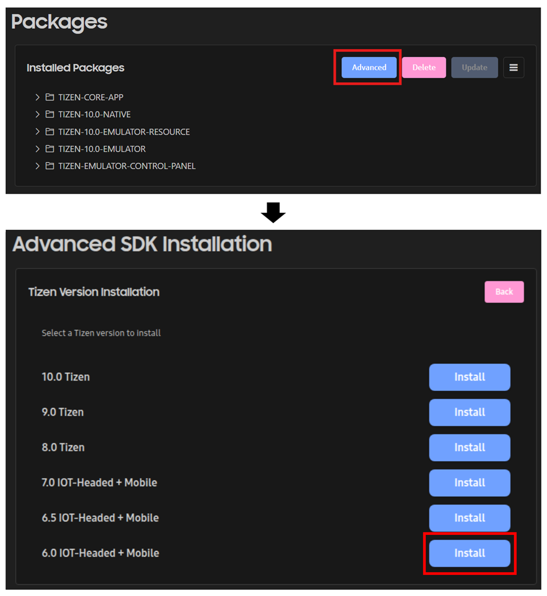
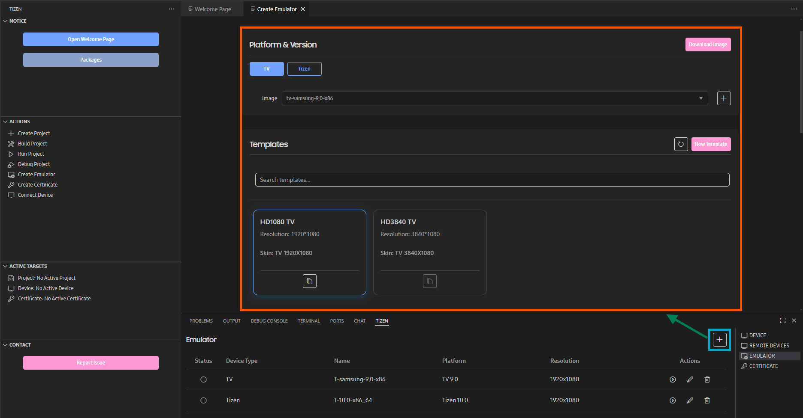
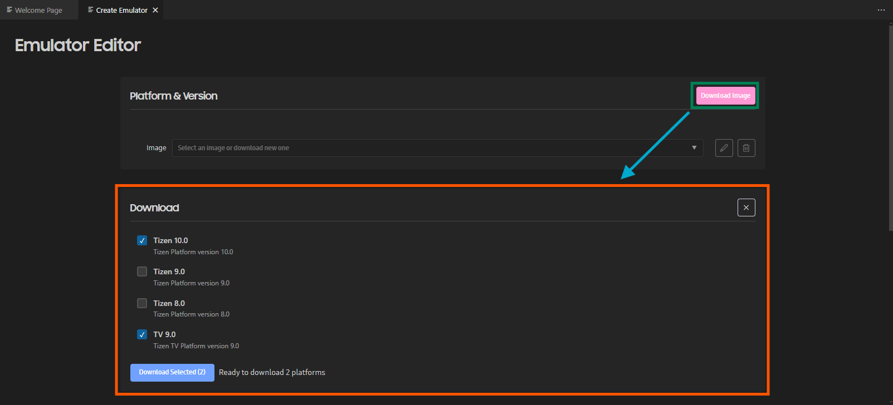
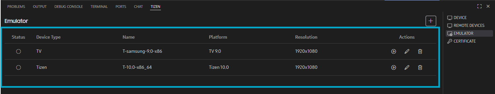
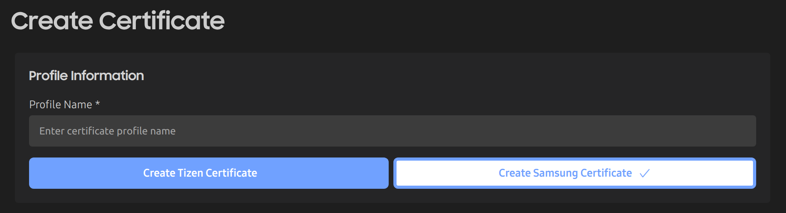
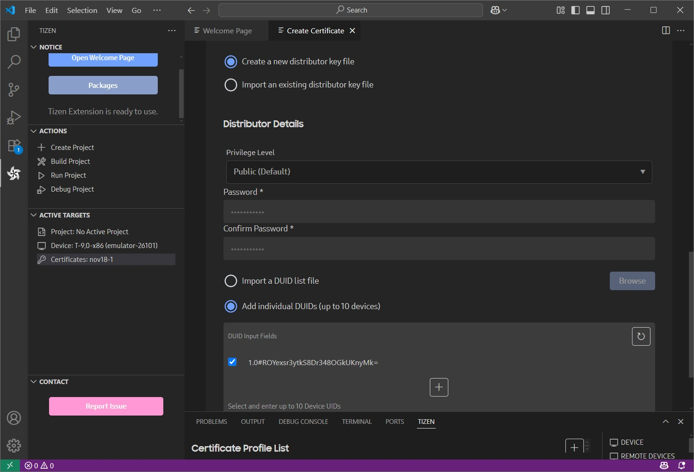

# Setting up VS Code Extension for Tizen

> [!NOTE]
> Support for Tizen Studio has ended with version 6.1. The `VS Code Extension for Tizen` is now the recommended tool for installing the Tizen SDK. For more information, visit the [Tizen Developers](https://developer.tizen.org/development/tizen-studio/tizen-studio-deprecation-notice/) site.

Download and install the latest release of Tizen SDK from the below link. It is recommended to use the `VS Code Extension for Tizen` although you can still build Flutter apps using CLI only.

- [Download Tizen SDK](https://samsungtizenos.com/tools-download/)
- [Tizen Docs: Installing VS Code Extension for Tizen](https://samsungtizenos.com/docs/sdktools/?sid=IxbvHeBMNspcp66uVvC)

## Install required packages

After installing the `VS Code Extension for Tizen`, open _Tizen: Package Manager_ from the Command Palette (Ctrl + Shift + P). Install the following packages required by flutter-tizen.

- [Advanced] - [6.0 IOT-Headed + Mobile]

To enable emulator support, install the following additional packages.

- [Advanced] - [9.0 Tizen or later]

## Set up Tizen emulators

If you installed packages for your target platforms in the previous step, you can use _Emulator Manager_ to manage and launch emulator instances. If you can't see any emulator instances in _Emulator Manager_, click the `+` button to open _Emulator Editor_.

Then, click the `Download Image` button in _Emulator Editor_ to download and install the emulator images for your target platforms.

Note: To use the TV Emulator, you need to download and install the TV 9.0 image via _Emulator Editor_.

To launch an emulator, select it in the list and click the _Start_ button () in the Actions column. You can also use the [`flutter-tizen emulators`](commands.md#emulators) command to launch an emulator without _Emulator Manager_.

Note: Launching a Tizen emulator requires HW virtualization (Intel VT-x/AMD-V) support. For more information, see [Emulator Requirements](https://samsungtizenos.com/docs/sdktools/?sid=9UIFnPqra1FQFU9WnCyo#content-emulator-requirements).

## Create a certificate profile

To install your app on a Tizen device or publish it to the TV App Store, you need to sign the app with a valid certificate. Use _Certificate Manager_, or the [`tizen certificate/security-profiles`](https://docs.tizen.org/application/tizen-studio/common-tools/command-line-interface) command (CLI) to create a certificate profile.

Choose _Create Samsung Certificate_ instead of _Create Tizen Certificate_ as the profile type if you're not sure.

You should specify the DUID of your device (including emulator) when creating a distributor certificate. The DUID will automatically appear in the list if the device is connected to the PC.

For detailed instructions, see [Samsung Tizen OS: Creating Certificates](https://samsungtizenos.com/docs/sdktools/?sid=rIHCiglrL104UptsbNwf).
