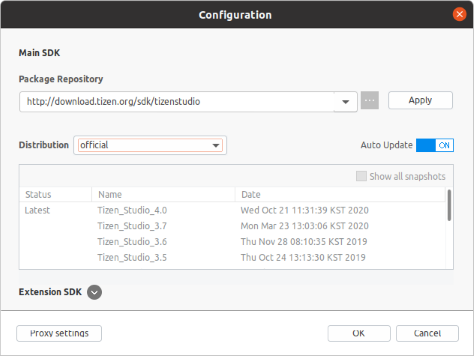

# Setting up Tizen SDK

Download and install the latest release of Tizen Studio from the below link. It is recommended to use the GUI installer although you can still build Flutter apps with CLI only.

- [Download Tizen Studio](https://developer.tizen.org/development/tizen-studio/download)
- [Tizen Docs: Installing Tizen Studio](https://docs.tizen.org/application/tizen-studio/setup/install-sdk)

## Install required packages

After installing Tizen Studio, the _Package Manager_ window will automatically pop up (otherwise launch it manually). Install the following packages required by flutter-tizen.

- **Required**
  - _[Tizen SDK tools] - [Native CLI]_
  - _[Tizen SDK tools] - [Baseline SDK] - [Certificate Manager]_
  - _[Extension SDK] - [IOT-Headed-6.0] - [Advanced] - [Native app. development (CLI)]_
  - _[Extension SDK] - [Samsung Certificate Extension]_

- **Optional**
  - _[8.0 Tizen] - [Emulator]_
  - _[6.0 Mobile] - [Advanced] - [Native app. development (CLI)]_
  - _[Extension SDK] - [TV Extensions-x.x] - [Emulator]_

You can also install these packages from the command line by following the instructions of `flutter-tizen doctor -v` after installing flutter-tizen.

If you cannot see extension packages in the _Extension SDK_ tab, click the configuration button (⚙️) and make sure you are using the latest official distribution.

## Set up Tizen emulators

If you installed emulator packages in the previous step, you can use _Emulator Manager_ to manage and launch emulator instances. If you can't see any emulator instance in the device list, open _Package Manager_ and install emulator packages of your target platform.

To launch an emulator, select a device and press _Launch_. You can also use the [`flutter-tizen emulators`](commands.md#emulators) command to launch an emulator without _Emulator Manager_.

Note: If you are using Windows on an AMD-based system, you cannot launch Tizen emulators because _Emulator Manager_ depends on _Intel HAXM_. For more information on HW virtualization, see [Tizen Docs: Increasing the Application Execution Speed](https://docs.tizen.org/application/tizen-studio/common-tools/emulator/#increasing-the-application-execution-speed).

## Create a Tizen certificate

To install your app on Tizen devices or publish on _TV App Store_, you need to sign the app with a valid certificate. Use _Certificate Manager_ (GUI), or the [`tizen certificate/security-profiles`](https://docs.tizen.org/application/tizen-studio/common-tools/command-line-interface) command (CLI) to create a Tizen or Samsung certificate.

Choose Tizen certificate if you only want to test your app on emulators. Otherwise, choose Samsung certificate and specify DUIDs of your devices when creating a distributor certificate.

For detailed instructions, see [Samsung Developers: Creating Certificates](https://developer.samsung.com/smarttv/develop/getting-started/setting-up-sdk/creating-certificates.html).
