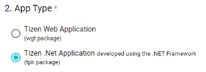
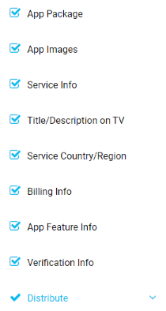
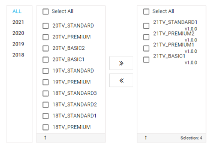

# Publishing apps on Samsung Galaxy Store and TV Seller Office

## Prepare for release

- Make sure your app's manifest file (`tizen/tizen-manifest.xml`) is configured properly. Update the package ID, app ID, label, icon, and required privileges if necessary. For more information on the XML elements in the file, see [Tizen Docs: Configuring the Application Manifest](https://docs.tizen.org/application/tizen-studio/native-tools/manifest-text-editor).

- Make sure your app is signed with a correct certificate for release. If you want to sign your app with a different certificate, open _Certificate Manager_ and set the profile you want to use to active.

- Build a release version of your app:

  ```sh
  # TV app
  flutter-tizen build tpk --device-profile tv
  ```

  A signed `.tpk` file should be generated in `build/tizen/tpk`.

- Test the release version of your app thoroughly on at least one real device.

  ```sh
  flutter-tizen install
  ```

## Release a TV app

1. Visit [**Samsung Apps TV Seller Office**](https://seller.samsungapps.com/tv) and sign up for an account.
1. After logging in, go to **Membership - Group Information** and fill out your group and seller information.
1. If you want to distribute your app outside the United States, you need to set your group type to Partner Group. Click **Request Partnership** and enter any necessary information to request partnership.

   

   For detailed information on the Seller Office partnership, see [Becoming Partners](https://developer.samsung.com/tv-seller-office/guides/membership/becoming-partner.html). To request the contact information for your local Content Manager, create a [**1:1 Q&A**](https://seller.samsungapps.com/tv/qna) support ticket.

1. If done, go back to the **Applications** screen, and click the **Create App** button to get started with the app registration process. Make sure to choose **Tizen .NET Application (TPK package)** as your app type.

   

1. Fill out detailed information about your app until all check marks in the left menu bar turn blue. You must attach a valid description file that clearly describes the features of your app in the **Verification Info** step.

   

1. In the **Request New Release** page of the final **Distribute** step, check and add only **2021 and later** model groups to the selected model group list. Flutter apps are not compatible with 2020 or older models.

   

1. Click **Done** to finish the registration process.

The store review process may take more than 4 weeks. If you run into any problem, create a [1:1 Q&A](https://seller.samsungapps.com/tv/qna) support ticket or open an [issue](https://github.com/flutter-tizen/flutter-tizen/issues) in this repo.

You may also find the following pages useful.

- [Samsung Apps TV Seller Office](https://developer.samsung.com/tv-seller-office/guides/overview.html)
- [Application Registration Q&A](https://developer.samsung.com/tv-seller-office/faq/application-registration.html)
