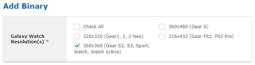
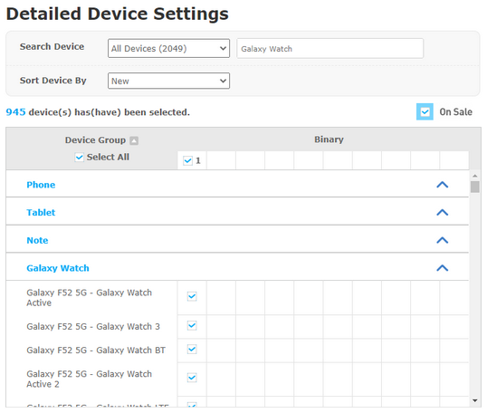

# Publishing your app on Samsung Galaxy Store/TV App Store

## Prepare for release

- Make sure your app's manifest file (`tizen/tizen-manifest.xml`) is configured properly. Update the package id, version, label, icon, and required privileges if necessary. The rest of the file is automatically configured by the tool, so you can leave the values at their default. For more information on the XML elements in the file, see [Tizen Docs: Configuring the Application Manifest](https://docs.tizen.org/application/tizen-studio/native-tools/manifest-text-editor).

- Make sure your app is signed with a correct certificate for release. If you want to sign your app with a different certificate, open _Certificate Manager_ and set the profile you want to use to active.

- Build a release version of your app:

  ```sh
  # Watch app
  flutter-tizen build tpk --device-profile wearable

  # TV app
  flutter-tizen build tpk --device-profile tv
  ```

  A signed `.tpk` file should be generated in `build/tizen`.

- Test the release version of your app thoroughly on at least one real device.

  ```sh
  flutter-tizen install
  ```

## Release a watch app

1. Visit [**Galaxy Store Seller Portal**](https://seller.samsungapps.com) and sign up for an account.
1. After logging in, follow the steps in [**this PDF file**](https://developer.samsung.com/glxygames/file/8d1b5610-1a28-411b-846d-f58e15cf9711) to register an app. For more information on the registration process, read [Samsung Developers: Get Started in Galaxy Store](https://developer.samsung.com/galaxy-games/get-started-in-galaxy-store.html).

Note that flutter-tizen only supports Tizen 4.0 and newer. Some old Gear devices may not be able to run Flutter apps because they run Tizen 3.0 or older. You can exclude such devices from the app's compatible devices list as follows.

- When adding a binary, uncheck all screen resolutions except _360x360_.

  

- When selecting compatible devices for a binary, uncheck all devices and add only Galaxy Watch series devices by typing _Galaxy Watch_ in the search field.

  

A newly registered app usually takes around 2 weeks for review, but the time may vary depending on various factors such as the countries selected in the _Country/Region & Price_ page.

## Release a TV app

**To be detailed.**
